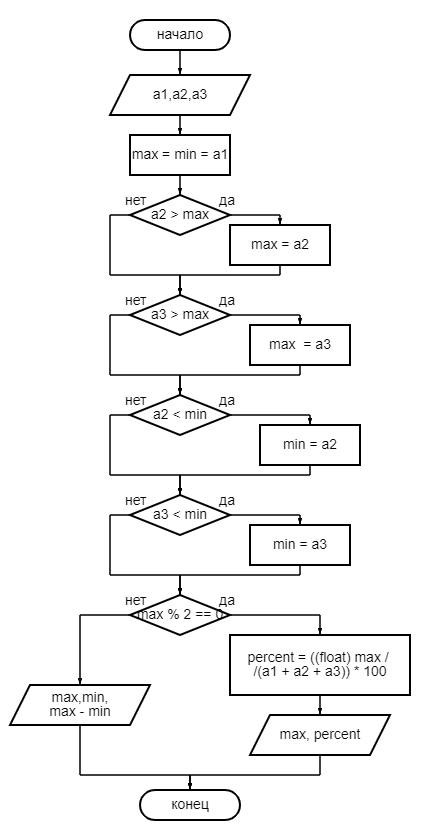

# Лабораторная работа №1.
## Ветвляющие алгортмы.
### Задание.
 Вывести номер и долю в процентах наибольшего из параметров `a1`,`a2`,`a3` в случае его чётности, и номера и разности значений наибольшего и наименьшего из параметров иначе.
#### Сложность: Well-done.
 Реализуйте “защиту от дурака” – обработайте пользовательский ввод таким образом, чтобы выполнение алгоритма программы невозможно было нарушить некорректным пользовательским вводом. 
### Получившийся код.
``` c
#include <stdio.h>
#include <stdlib.h>
#include <math.h>

int main()
{
    int a1, a2, a3;
    int min, max;
    float percent;
    int result;

    // Чтение введеных значений и проверка
    do {
        printf("Enter first number (a1): ");
        result = scanf("%d", &a1);
        
        while(getchar() != '\n'); // Очистка значения
        
    } while(result != 1); // Продолжает запрашивать до тех пор, пока пользователь не введет корректные данные

    do {
        printf("Enter second number (a2): ");
        result = scanf("%d", &a2);
        
        while(getchar() != '\n'); // Очистка значения
        
    } while(result != 1);

    do {
        printf("Enter third number (a3): ");
        result = scanf("%d", &a3);
        
        while(getchar() != '\n'); // Очистка значения
        
    } while(result != 1);

    // Присваиваем наименьшему и наибольшему значениям значение a1
    min = max = a1;

    // Определяем наименьшее и наибольшее числа
    if (a2 > max) max = a2;
    if (a3 > max) max = a3;
    if (a2 < min) min = a2;
    if (a3 < min) min = a3;

    // Проверка четность наибольшего числа
    if (max % 2 == 0) {
        // Входное значение является четным - выходное число и процент
        percent = ((float) max / (a1 + a2 + a3)) * 100;
        printf("The largest number is: %d and its percentage of the sum of all numbers is: %f%%\n", max, percent);
    } else {
        // Наибольшее число не является четным - выводит числа и их разницу
        printf("The largest and smallest numbers is: %d, %d and the difference with the smallest number is: %d\n",max, min, max - min);
    }

   
}
```
### Блок схема.

### Результат при наибольшем чётном числе.

### результат при наибольшем нечётном числе.
